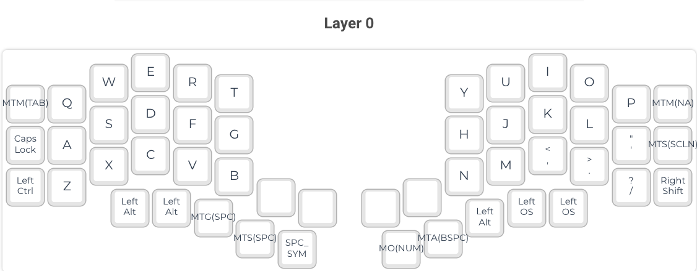
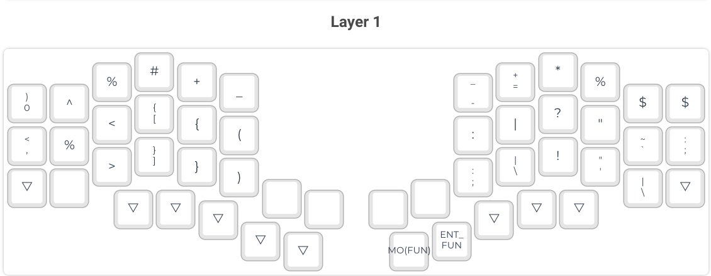
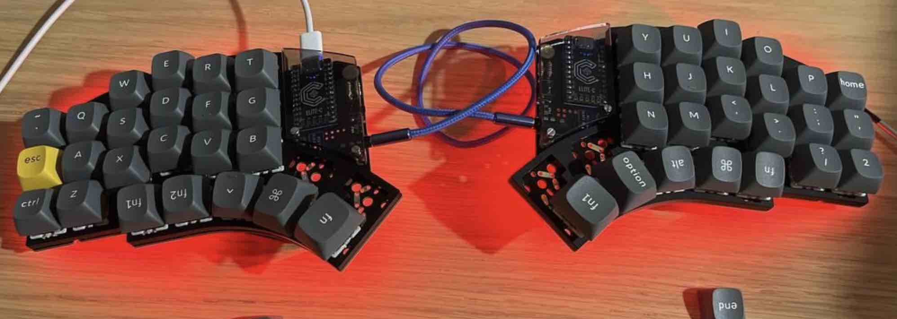

# Kyria Keymap

I created this repository to make **a thin layer** of custom adjustment for the QMK firmware instead of embedding this
It is used `as a symlink`.

## Features

- [Aseprite](https://www.aseprite.org/) pixelart images conversion to OLED displays
  - Adjusted [image2cpp](http://javl.github.io/image2cpp/) in build pipeline
- Automatic layer printables generation through Cypress

## Current Layout

### Base Layer

### Symbol Layer

### Numbers Layer

### Function Layer

### Definitions:

#### Mod-Tap shorthands

- `MTC` - **Hold**: _Control_
- `MTS` - **Hold**: _Shift_
- `MTA` - **Hold**: _Alt_
- `MTG` - **Hold**: _Command_
- `MTM` - **Hold**: _Meh_ (_Command_ + _Control_ + _Shift_)
- `MTH` - **Hold**: _Hyper_ (_Command_ + _Control_ + _Shift_ + _Alt_)

#### Layer-Tap shorthands

- `SPC_LSYM` - **Tap**: _Space_ | **Hold** : Layer "Symbol"
- `ENT_LNUM` - **Tap**: _Enter_ | **Hold** : Layer "Numbers"
- `ENT_LFUN` - **Tap**: _Enter_ | **Hold** : Layer "Function"

#### Key shorthands

- `SPC` - **Tap** _Space_
- `BSPC` - **Tap** _Backspace_
- `TAB` - **Tap** _Tab_
- `NA` - **Not assigned**

## Current build

## Build log

2023-01-21

- Soldered RGB diodes
- Replaced switches:
  - Previous: [Kailh Choc Low Profile Brown](https://splitkb.com/products/kailh-low-profile-choc-switches)
  - Current: [Keychron Double Shot PBT OSA Grey](https://shelter.pl/produkt/keychron-double-shot-pbt-osa-full-set-keycap-set/?attribute_pa_kolor=szary&attribute_pa_wersja=full-set)
- Replaced keycaps:
  - Previous: [Kailh Choc Transparent](https://splitkb.com/collections/switches-and-keycaps/products/kailh-choc-transparent-keycaps)
  - Current: [Gateron - G Pro 2.0](https://shelter.pl/produkt/gateron-g-pro-2-0-switch/?attribute_pa_mechanizm=red&attribute_pa_ilosc=110-szt)
