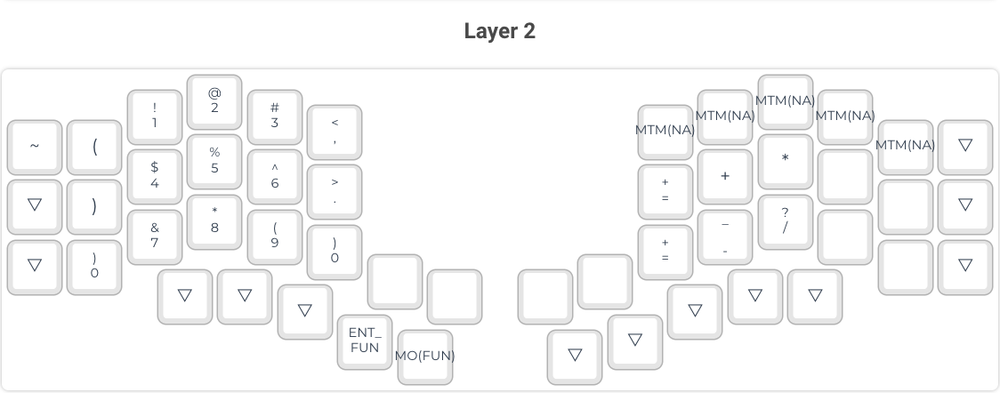

# Kyria Keymap

I created this repository to make **a thin layer** of custom adjustment for the QMK firmware instead of embedding this
It is used `as a symlink`.

## Features

- [Aseprite](https://www.aseprite.org/) pixelart images conversion to OLED displays
  - Adjusted [image2cpp](http://javl.github.io/image2cpp/) in build pipeline
- Automatic layer printables generation through Cypress

## Current Layout

### Base Layer

### Symbol Layer

### Numbers Layer

### Function Layer

